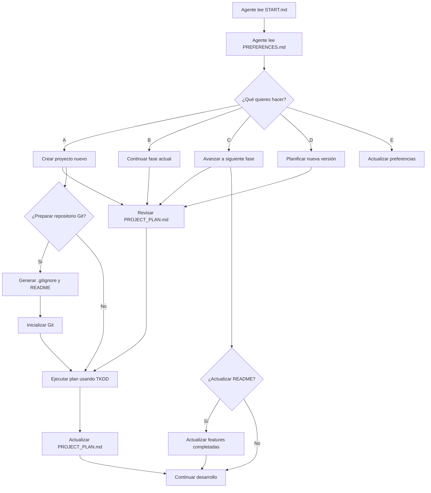

# CADD - Context-Assisted Development Driven

> **🚀 Metodología para vibe coding productivo con IA**

## Inicio Rápido

### Para Agentes de IA:
```
Lee el archivo .CADD/START.md
```

### Para Usuarios:
1. **Copia** la carpeta `.CADD/` a tu proyecto
2. **Personaliza** `.CADD/PREFERENCES.md` con tus datos
3. **Inicia** cualquier conversación con: `Lee el archivo .CADD/START.md`

## Sistema de Archivos

```
.CADD/
├── START.md              # 🎯 Punto de partida universal
├── PREFERENCES.md        # 🤖 Tus preferencias personales
├── PROJECT_PLAN.md       # 📋 Plan específico del proyecto
├── TKDD_METHODOLOGY.md   # 🎫 Metodología para tickets
└── USER_GUIDE.md         # 📖 Guía completa
```

## Flujo de Trabajo



## Nuevas Funcionalidades v1.1.0

### 🔧 **Configuración Automática de Git**
- **Genera .gitignore** basado en tu stack tecnológico
- **Crea README.md** completo desde PROJECT_PLAN.md
- **Inicializa repositorio** con commit inicial
- **Sugiere** configuración de repositorio remoto

### 📚 **Mantenimiento de README**
- **Actualiza automáticamente** después de cada fase
- **Marca features** como ✅ completadas
- **Sincroniza** documentación con progreso real
- **Mantiene** información técnica actualizada

## Beneficios

- **🎯 Contexto estructurado** - Sin ambigüedades
- **🔄 Reutilizable** - Una vez configurado, funciona en cualquier proyecto
- **📈 Escalable** - Desde principiante hasta experto
- **🤖 AI-optimizado** - Diseñado específicamente para agentes de IA
- **⚡ Productivo** - Menos tiempo explicando, más tiempo programando
- **🔧 Automatizado** - Configuración de Git y documentación automática

## Flujo de Trabajo Extendido

### 🚀 **Nuevo Proyecto**
1. Planificación inicial
2. Generación de tickets TKDD
3. **¿Preparar Git?** → Genera .gitignore y README
4. Inicialización automática del repositorio
5. Desarrollo con seguimiento estructurado

### 📋 **Avance de Fases**
1. Revisión de progreso
2. Resumen de completado
3. Generación de tickets siguientes
4. **¿Actualizar README?** → Sincronización automática
5. Commit de cambios en documentación

## Versiones

- **v1.1.0** - Automatización de Git y mantenimiento de README
  - Configuración automática de repositorio Git
  - Generación de .gitignore basado en stack tecnológico
  - Creación de README.md desde PROJECT_PLAN.md
  - Actualización automática de documentación
  - Commits con mensajes descriptivos

- **v1.0.0** - Metodología completa en inglés optimizada para LLMs
  - Archivos técnicos en inglés para mejor comprensión de agentes
  - Preferencias de usuario en idioma elegido
  - Reglas mejoradas para gestión de recordatorios

---

**¿Listo para empezar?** → [Lee la guía completa](.CADD/USER_GUIDE.md)
