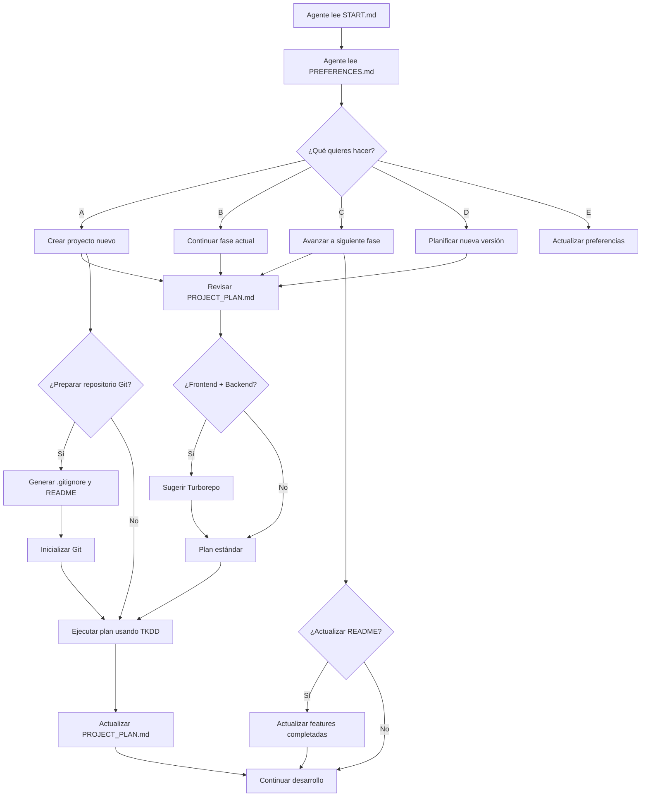

# CADD - Context-Assisted Development Driven

> **🚀 Metodología para vibe coding productivo con IA**

## Inicio Rápido

### Para Agentes de IA:
```
Lee el archivo .CADD/START.md
```

### Para Usuarios:
1. **Copia** la carpeta `.CADD/` a tu proyecto
2. **Personaliza** `.CADD/PREFERENCES.md` con tus datos
3. **Inicia** cualquier conversación con: `Lee el archivo .CADD/START.md`

## Sistema de Archivos

```
.CADD/
├── START.md              # 🎯 Punto de partida universal
├── PREFERENCES.md        # 🤖 Tus preferencias personales
├── PROJECT_PLAN.md       # 📋 Plan específico del proyecto
├── TKDD_METHODOLOGY.md   # 🎫 Metodología para tickets
└── USER_GUIDE.md         # 📖 Guía completa
```

## Flujo de Trabajo



## Nuevas Funcionalidades v1.2.0

### 🏗️ **Sugerencia Inteligente de Turborepo**
- **Detecta** cuando planificas frontend + backend
- **Sugiere Turborepo** con beneficios claros:
  - ✅ Código compartido entre apps
  - ✅ Builds optimizados con caching
  - ✅ Workflows paralelos
  - ✅ Mejor gestión de dependencias
- **Integra** automáticamente en .gitignore y README

### 🔧 **Gestión Mejorada de Preferencias**
- **Informa** que puedes cambiar preferencias cuando quieras
- **Manejo inteligente** de rechazo de configuración
- **No vuelve a preguntar** si rechazas la configuración
- **Ayuda disponible** solo cuando la solicites

### 📚 **Mantenimiento de README**
- **Actualiza automáticamente** después de cada fase
- **Marca features** como ✅ completadas
- **Sincroniza** documentación con progreso real
- **Mantiene** información técnica actualizada
- **Soporte para Turborepo** con instrucciones específicas

## Beneficios

- **🎯 Contexto estructurado** - Sin ambigüedades
- **🔄 Reutilizable** - Una vez configurado, funciona en cualquier proyecto
- **📈 Escalable** - Desde principiante hasta experto
- **🤖 AI-optimizado** - Diseñado específicamente para agentes de IA
- **⚡ Productivo** - Menos tiempo explicando, más tiempo programando
- **🔧 Automatizado** - Configuración de Git y documentación automática
- **🏗️ Monorepo-ready** - Sugerencias inteligentes para arquitectura

## Flujo de Trabajo Extendido

### 🚀 **Nuevo Proyecto**
1. Planificación inicial
2. **¿Frontend + Backend?** → Sugerencia de Turborepo
3. Generación de tickets TKDD
4. **¿Preparar Git?** → Genera .gitignore y README
5. Inicialización automática del repositorio
6. Desarrollo con seguimiento estructurado

### 📋 **Avance de Fases**
1. Revisión de progreso
2. Resumen de completado
3. Generación de tickets siguientes
4. **¿Actualizar README?** → Sincronización automática
5. Commit de cambios en documentación

### ⚙️ **Gestión de Preferencias**
1. Configuración opcional en primera sesión
2. **"Puedes cambiar tus preferencias cuando quieras"**
3. Si rechazas: **"Solo pídeme ayuda cuando quieras. No volveré a preguntar"**
4. Ayuda disponible bajo demanda

## Versiones

- **v1.2.0** - Sugerencia de Turborepo y gestión mejorada de preferencias
  - Sugerencia inteligente de Turborepo para proyectos fullstack
  - Gestión mejorada de preferencias con opciones flexibles
  - Manejo educado del rechazo de configuración
  - Integración completa de Turborepo en templates
  - Mejor experiencia de usuario en configuración inicial

- **v1.1.1** - Fix agent communication and preferences detection
  - Comunicación directa y concisa
  - Eliminación de falsos positivos en preferencias
  - PREFERENCES.md convertido a inglés
  - Referencia a USER_GUIDE.md
  - Reglas de comunicación mejoradas

- **v1.1.0** - Automatización de Git y mantenimiento de README
  - Configuración automática de repositorio Git
  - Generación de .gitignore basado en stack tecnológico
  - Creación de README.md desde PROJECT_PLAN.md
  - Actualización automática de documentación
  - Commits con mensajes descriptivos

- **v1.0.0** - Metodología completa en inglés optimizada para LLMs
  - Archivos técnicos en inglés para mejor comprensión de agentes
  - Preferencias de usuario en idioma elegido
  - Reglas mejoradas para gestión de recordatorios

---

**¿Listo para empezar?** → [Lee la guía completa](.CADD/USER_GUIDE.md)
