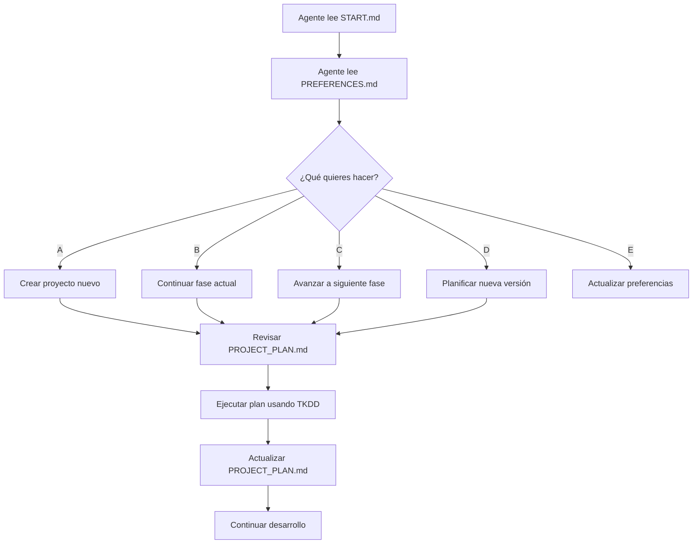

# CADD - Context-Assisted Development Driven

> **🚀 Metodología para vibe coding productivo con IA**

## Inicio Rápido

### Para Agentes de IA:
```
Lee el archivo .CADD/START.md
```

### Para Usuarios:
1. **Copia** la carpeta `.CADD/` a tu proyecto
2. **Personaliza** `.CADD/PREFERENCES.md` con tus datos
3. **Inicia** cualquier conversación con: `Lee el archivo .CADD/START.md`

## Sistema de Archivos

```
.CADD/
├── START.md              # 🎯 Punto de partida universal
├── PREFERENCES.md        # 🤖 Tus preferencias personales
├── PROJECT_PLAN.md       # 📋 Plan específico del proyecto
├── TKDD_METHODOLOGY.md   # 🎫 Metodología para tickets
└── USER_GUIDE.md         # 📖 Guía completa
```

## Flujo de Trabajo



## Beneficios

- **🎯 Contexto estructurado** - Sin ambigüedades
- **🔄 Reutilizable** - Una vez configurado, funciona en cualquier proyecto
- **📈 Escalable** - Desde principiante hasta experto
- **🤖 AI-optimizado** - Diseñado específicamente para agentes de IA
- **⚡ Productivo** - Menos tiempo explicando, más tiempo programando

## Versiones

- **v1.0.0** - Metodología completa en inglés optimizada para LLMs
- Archivos técnicos en inglés para mejor comprensión de agentes
- Preferencias de usuario en idioma elegido
- Reglas mejoradas para gestión de recordatorios

---

**¿Listo para empezar?** → [Lee la guía completa](.CADD/USER_GUIDE.md)
